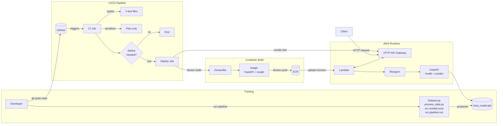

# MLOps & Deployment Guide

This document walks through how the trained donor-return model is packaged as a Docker image, exposed via a FastAPI application, deployed to AWS Lambda behind an HTTP API Gateway, and wired into a Terraform-driven infrastructure plus CI/CD workflow.

The focus here is on **serving and deployment**, not on model training (see the main README and ML_Pipeline_workflow docs for that portion).

At a glance, this guide covers:

- **Model packaging** – FastAPI service, model artifact, and dependencies bundled into a Lambda-compatible Docker image.
- **Infrastructure-as-code** – Terraform-managed AWS services (ECR, IAM, Lambda, HTTP API Gateway, outputs).
- **CI/CD** – GitHub Actions workflow that runs tests, validates infra, and updates the Lambda image when core files change.
- **Runtime behavior** – A single Lambda function exposing `/health` and `/predict` endpoints through HTTP API Gateway.

---

## 1. Model Packaging

### 1.1 Inference API Wrapper (FastAPI)

**Location:** `app/main.py`

The production model is served through a small FastAPI application that wraps the trained pipeline saved in `models/best_model.pkl`.

Key elements:

- **Model loading**
  - `MODEL_PATH` points to `../models/best_model.pkl`.
  - `_load_model()` loads the serialized sklearn/ImbPipeline via `joblib.load`.
  - `MODEL` is instantiated at import time so startup is fast for subsequent requests.

- **Schema alignment**
  - `EXPECTED_FEATURES` is a hard-coded list mirroring `FEATURE_COLUMNS` from `src.features.preprocess`.
  - This ensures the inference schema (API payload) stays aligned with the training schema.

- **Request/response models**
  - `PredictionRequest` (Pydantic): has a single field `features: Dict[str, Union[float, int, bool]]`.
    - The dict keys must cover **all** `EXPECTED_FEATURES`.
  - `PredictionResponse` (Pydantic):
    - `probability: float` – model score in [0, 1].
    - `prediction: int` – 0/1 label, derived by thresholding probability at 0.5 by default.

- **Endpoints**
  - `GET /health`
    - Returns `{ "status": "ok" }`.
    - Used both in local health checks and CI tests.
  - `POST /predict`
    - Validates incoming payload keys against `EXPECTED_FEATURES`.
    - Converts booleans to integers where needed.
    - Calls `MODEL.predict_proba(df)[0, 1]` to get the positive-class probability.
    - Applies `PREDICTION_THRESHOLD = 0.5` to derive the final class.
    - Returns `PredictionResponse`.

- **Local development entrypoint**
  - If `python app/main.py` is executed directly, it starts a development server:
    - `uvicorn.run(app, host="0.0.0.0", port=8000)`.

#### Local testing workflow

1. **Start the API locally** (from repo root):

   ```powershell
   (prml-project) PS> python app/main.py
   ```

   Uvicorn logs show the server listening on `http://0.0.0.0:8000`.

2. **Smoke test `/health`**:

   - Browser: open <http://localhost:8000/health> → `{"status":"ok"}`.
   - CLI: `Invoke-RestMethod -Uri http://localhost:8000/health`.

3. **Call `/predict` (POST only)**:

   - Use the autogenerated docs at <http://localhost:8000/docs> → expand `POST /predict` → *Try it out* → paste `predict_example.json` and execute.
   - Or PowerShell:

     ```powershell
     Invoke-RestMethod -Uri http://localhost:8000/predict `
       -Method Post `
       -ContentType "application/json" `
       -Body (Get-Content .\predict_example.json -Raw)
     ```

   A GET request to `/predict` returns `{"detail":"Method Not Allowed"}` because the endpoint is POST-only; this is expected.

### 1.2 API Dependencies

**Location:** `app/requirements.txt`

The FastAPI app uses a slim dependency set focused on inference:

- `fastapi`, `uvicorn[standard]`, `pydantic` – API framework and schema validation.
- `numpy`, `pandas`, `scikit-learn`, `joblib` – numeric stack and model runtime.
- `mangum` – ASGI-to-Lambda adapter.
- `httpx` – HTTP client used in tests.

At build time these dependencies are installed into the Lambda image and used by both the FastAPI app and the Mangum handler.

### 1.3 Docker Image for Lambda

**Location:** `Dockerfile`

The model is packaged as a **Lambda container image** built on the official AWS Lambda Python base image:

```dockerfile
FROM public.ecr.aws/lambda/python:3.11

WORKDIR /var/task

COPY app/requirements.txt ./requirements.txt
RUN pip install --no-cache-dir -r requirements.txt

COPY app ./app
COPY models/best_model.pkl ./models/best_model.pkl
COPY app_lambda.py ./app_lambda.py

CMD ["app_lambda.handler"]
```

Important points:

- **Base image**: `public.ecr.aws/lambda/python:3.11`
  - Provides the AWS Lambda runtime interface and entrypoint.

- **Model and code inclusion**
  - `app/` is copied into the image (FastAPI app and its code).
  - `models/best_model.pkl` is copied into `./models/best_model.pkl` so `app/main.py` can load it.
  - `app_lambda.py` is copied as the Lambda entry wrapper.

- **Lambda handler**
  - `CMD ["app_lambda.handler"]` tells Lambda to call the `handler` object exported by `app_lambda.py`.

### 1.4 Lambda Entry Wrapper (Mangum)

**Location:** `app_lambda.py`

This file is intentionally tiny:

```python
from mangum import Mangum
from app.main import app

handler = Mangum(app)
```

- `Mangum(app)` turns the FastAPI ASGI app into a handler compatible with AWS Lambda and API Gateway HTTP APIs.
- The Dockerfile’s `CMD` points Lambda at `app_lambda.handler`.

---

## 2. Infrastructure & Deployment (Terraform + AWS)

Infrastructure is defined declaratively with Terraform under `infra/`. The primary files are `main.tf`, `ecr.tf`, `lambda.tf`, `api_gateway.tf`, and `outputs.tf`. Terraform ensures environments are reproducible, versioned, and easy to audit, while deployment of the container image is triggered from CI/CD.

### 2.1 Terraform Layout & Variables

- **Provider setup (`main.tf`)**
  - Requires Terraform `>= 1.5.0` and AWS provider `~> 5.0`.
  - Configures the AWS region using `var.aws_region` (default `ap-southeast-1`).
- **Service naming**
  - `var.service_name` is the suffix/prefix applied to all AWS resources (default `donor-api`).
  - `var.docker_image_tag` indicates which image tag Lambda should run (default `latest`).
- These variables keep the stack consistent whether applied locally or from CI, and they align with the GitHub secrets used in the deploy workflow.

### 2.2 Container Registry (Amazon ECR)

**Location:** `infra/ecr.tf`

```hcl
resource "aws_ecr_repository" "app" {
  name = var.service_name

  image_scanning_configuration {
    scan_on_push = true
  }

  force_delete = true
}
```

- Creates an ECR repository named after `var.service_name`.
- Enables image scanning on push.
- `force_delete = true` allows cleanup even with images present (use carefully in production).

### 2.3 IAM Role & Lambda Function (Image-based)

**Location:** `infra/lambda.tf`

Lambda execution role and function:

```hcl
data "aws_iam_policy_document" "lambda_assume" {
  statement {
    actions = ["sts:AssumeRole"]

    principals {
      type        = "Service"
      identifiers = ["lambda.amazonaws.com"]
    }
  }
}

resource "aws_iam_role" "lambda_exec" {
  name               = "${var.service_name}-lambda-exec"
  assume_role_policy = data.aws_iam_policy_document.lambda_assume.json
}

resource "aws_iam_role_policy_attachment" "lambda_basic" {
  role       = aws_iam_role.lambda_exec.name
  policy_arn = "arn:aws:iam::aws:policy/service-role/AWSLambdaBasicExecutionRole"
}

resource "aws_lambda_function" "app" {
  function_name = var.service_name
  role          = aws_iam_role.lambda_exec.arn

  package_type = "Image"
  image_uri    = "${aws_ecr_repository.app.repository_url}:${var.docker_image_tag}"

  timeout       = 30
  memory_size   = 1024
  architectures = ["x86_64"]
}
```

Key points:

- Lambda uses **container images** from the ECR repository created earlier.
- The `image_uri` is built from the repository URL and `var.docker_image_tag` (e.g. `latest`).
- Execution role has basic logging permissions via `AWSLambdaBasicExecutionRole`.
- Timeouts and memory can be tuned based on model latency and size.

### 2.4 HTTP API Gateway Integration

**Location:** `infra/api_gateway.tf`

This file exposes the Lambda via a public HTTP API (API Gateway v2):

```hcl
resource "aws_apigatewayv2_api" "http" {
  name          = "${var.service_name}-http-api"
  protocol_type = "HTTP"
}

resource "aws_apigatewayv2_integration" "lambda" {
  api_id           = aws_apigatewayv2_api.http.id
  integration_type = "AWS_PROXY"
  integration_uri  = aws_lambda_function.app.invoke_arn

  payload_format_version = "2.0"
}

resource "aws_apigatewayv2_route" "default" {
  api_id    = aws_apigatewayv2_api.http.id
  route_key = "ANY /{proxy+}"
  target    = "integrations/${aws_apigatewayv2_integration.lambda.id}"
}

resource "aws_apigatewayv2_stage" "default" {
  api_id      = aws_apigatewayv2_api.http.id
  name        = "$default"
  auto_deploy = true
}

resource "aws_lambda_permission" "apigw" {
  statement_id  = "AllowAPIGatewayInvoke"
  action        = "lambda:InvokeFunction"
  function_name = aws_lambda_function.app.function_name
  principal     = "apigateway.amazonaws.com"
  source_arn    = "${aws_apigatewayv2_api.http.execution_arn}/*/*"
}
```

- **HTTP API**: simple HTTP endpoint fronting the Lambda.
- **Proxy routing**: `ANY /{proxy+}` forwards all paths (e.g. `/predict`) to the same Lambda function.
- **Payload v2.0**: Mangum understands the HTTP API event format v2 and translates it into ASGI requests for FastAPI.
- **Lambda permission**: grants API Gateway permission to invoke the Lambda function.

### 2.5 Terraform Outputs

**Location:** `infra/outputs.tf`

```hcl
output "ecr_repository_url" {
  description = "ECR repository URL for the donor API image"
  value       = aws_ecr_repository.app.repository_url
}

output "lambda_function_name" {
  description = "Name of the deployed Lambda function"
  value       = aws_lambda_function.app.function_name
}

output "http_api_invoke_url" {
  description = "Invoke URL for the HTTP API (proxying to Lambda)"
  value       = aws_apigatewayv2_stage.default.invoke_url
}
```

These outputs feed both manual operators (e.g., quickly retrieving the invoke URL) and the GitHub Actions deploy job via repository secrets.

### 2.6 Provisioning Locally & Preparing Credentials

This project assumes you have Terraform installed and AWS credentials configured with permissions for ECR, IAM, Lambda, and API Gateway. General steps:

1. **Install Terraform**
   - Download from <https://developer.hashicorp.com/terraform/downloads> and place the binary on your PATH (on Windows, `C:\Program Files\Hashicorp\Terraform` is a common location).
   - Confirm availability with `terraform -version`.
2. **Configure AWS credentials**
   - Install the AWS CLI (<https://docs.aws.amazon.com/cli/latest/userguide/getting-started-install.html>).
   - Run `aws configure` and supply an access key, secret key, and default region (should match `var.aws_region`, e.g., `ap-southeast-1`). This populates `%UserProfile%\.aws\credentials` on Windows (or `~/.aws/credentials` on Unix-like systems), which Terraform reads automatically.
3. **Apply Terraform (manual run)**
   - From the repo root:

     ```powershell
     cd infra
     terraform init
     terraform plan
     terraform apply
     ```

   - The CI workflow only runs `terraform plan` for validation; applying changes is intentionally manual to avoid accidental infrastructure drift.

#### Configure AWS-related GitHub secrets

The CI/CD workflow `.github/workflows/ci-and-deploy-lambda.yml` expects several secrets at the **repository** level. In GitHub:

1. Go to **Settings → Secrets and variables → Actions → New repository secret**.
2. Create the following secrets:

- `AWS_ACCESS_KEY_ID`
- `AWS_SECRET_ACCESS_KEY`
- `AWS_REGION` – must match the region used by Terraform (e.g. `ap-southeast-1`).
- `ECR_REPOSITORY_NAME` – should match `var.service_name` in `infra/main.tf` (default `donor-api`) or the actual ECR repository name.
- `LAMBDA_FUNCTION_NAME` – should match the deployed Lambda’s name (by default also `donor-api`).
- `HTTP_API_INVOKE_URL` – the invoke URL of the deployed HTTP API (obtain via `terraform output http_api_invoke_url`).

These secrets are used by the workflow to:

- Authenticate to AWS (`configure-aws-credentials` action).
- Know which ECR repository to push the Docker image to.
- Know which Lambda function to update with the new container image.
- Run a post-deploy `/predict` smoke test against the correct HTTP API endpoint.

---

## 3. CI/CD for ML & Deployment

**Location:** `.github/workflows/ci-and-deploy-lambda.yml`

This GitHub Actions workflow has two main jobs:

1. **`ci`** – run tests, validate Terraform, and decide if deployment is needed.
2. **`deploy`** – build & push the Lambda Docker image to ECR and update the Lambda function if necessary.

### 3.1 CI Job (Testing & Validation)

Triggers:

- On every push to `main` when certain paths change:
  - `app/**`, `src/**`, `infra/**`, `models/best_model.pkl`, `Dockerfile`, `app_lambda.py`, `predict_example.json`, `tests/**`.
- On manual `workflow_dispatch`.

> Note: **tests-only changes** (files under `tests/**` with no other changes) still run the CI job, but they do **not** set `deploy_needed=true`, so the deploy job is skipped.

Steps:

- **Checkout code**
  - Uses `actions/checkout@v4` with `fetch-depth: 0` (full history for diffing).

- **Decide if deploy is needed**
  - Compares changed files between `before` and `after` commits.
  - Sets `deploy_needed` output to `true` if any of the non-test key paths changed (`app/*`, `src/*`, `infra/*`, `models/best_model.pkl`, `Dockerfile`, `app_lambda.py`, `predict_example.json`), or if manually triggered.

- **Python setup + dependencies**
  - Uses Python 3.11.
  - Installs `app/requirements.txt` and `pytest`.

- **Core tests**
  - Runs:
    - `tests/test_api.py` – API contract tests using FastAPI TestClient.
    - `tests/test_data_schema.py` – validates `processed_donor_features.csv` matches expected schema.
    - `tests/test_model_artifact.py` – ensures `models/best_model.pkl` exists and behaves as expected.

- **Predict example smoke test**
  - Runs `tests/test_predict_example_payload.py` to ensure:
    - `predict_example.json` matches `EXPECTED_FEATURES`.
    - The `/predict` endpoint works end-to-end in the test client.

- **Terraform checks (no apply)**
  - `terraform init -backend=false` in `infra/`.
  - `terraform fmt -check` and `terraform validate`.
  - `terraform plan` to ensure changes are syntactically and semantically valid.

> Note: The CI job does **not** run training; it assumes `models/best_model.pkl` is already present or updated separately.

### 3.2 Deploy Job (Container Build & Lambda Update)

Runs **only if**:

- `needs.ci.outputs.deploy_needed == 'true'`.

Environment variables are drawn from GitHub secrets:

- `AWS_REGION` – region for ECR and Lambda.
- `ECR_REPOSITORY_NAME` – name of the ECR repository (must match `var.service_name` or be wired accordingly).
- `LAMBDA_FUNCTION_NAME` – name of the existing Lambda function.
- `HTTP_API_INVOKE_URL` – public HTTP API base URL for post-deploy smoke tests.

Steps:

1. **Checkout code**
2. **Configure AWS credentials** using `aws-actions/configure-aws-credentials`.
3. **Login to ECR** using `aws-actions/amazon-ecr-login`.
4. **Build & push Docker image**
   - Builds image from repo root using the provided `Dockerfile`:
     - `docker build -t $ECR_REGISTRY/$ECR_REPOSITORY:$IMAGE_TAG .`
   - Pushes the image to ECR:
     - `docker push $ECR_REGISTRY/$ECR_REPOSITORY:$IMAGE_TAG`.
5. **Update Lambda function image**
   - Calls `aws lambda update-function-code` with the new image URI.
6. **Post-deploy smoke test**
   - Constructs the `/predict` URL from `HTTP_API_INVOKE_URL`.
   - Sends the contents of `predict_example.json` as the request body.
   - Asserts:
     - HTTP status is 200.
     - `probability` is within [0, 1].
     - `prediction` is either 0 or 1.

If any of these checks fail, the deploy job fails, providing early feedback.

---

## 4. How Everything Fits Together

End-to-end deployment view:

1. **Training & artifact creation** (run locally or in a separate step)
   - `python Dataset.py` → `python eda.py` → `python process_data.py` →
     `python -m src.models.tune` (optional but recommended) → `python -m src.pipeline.run`.
   - Produces `models/best_model.pkl`.

2. **Local API testing (optional)**
   - Start FastAPI locally via `uvicorn app.main:app --reload` or `python app/main.py`.
   - Send requests that match `EXPECTED_FEATURES` to `/predict`.

3. **CI/CD pipeline on push to main**
   - Runs API + data schema + artifact tests.
   - Validates Terraform.
   - Decides whether a deploy is necessary.

4. **Container build & deployment**
   - Builds a Lambda-compatible Docker image using the `Dockerfile` (includes app code + `best_model.pkl`).
   - Pushes to Amazon ECR.
   - Updates the existing Lambda function to use the new image.

5. **Runtime serving**
   - API Gateway HTTP API receives `/health` and `/predict` requests.
   - Forwards them (via proxy integration) to the Lambda container.
   - Mangum converts the event into an ASGI request for FastAPI.
   - FastAPI routes to the appropriate endpoint, uses `best_model.pkl` for inference on `/predict`, and returns a JSON response.

This MLOps stack ensures that:

- The **model artifact** and **serving stack** are packaged together in an immutable container.
- **Schema consistency** between training and serving is enforced by shared feature definitions and tests.
- **CI** prevents regressions in the API, data, and model artifacts.
- **CD** automatically rolls out a new model version to Lambda when relevant files change and tests pass.

---

## 5. MLOps Architecture (Mermaid Diagram)


